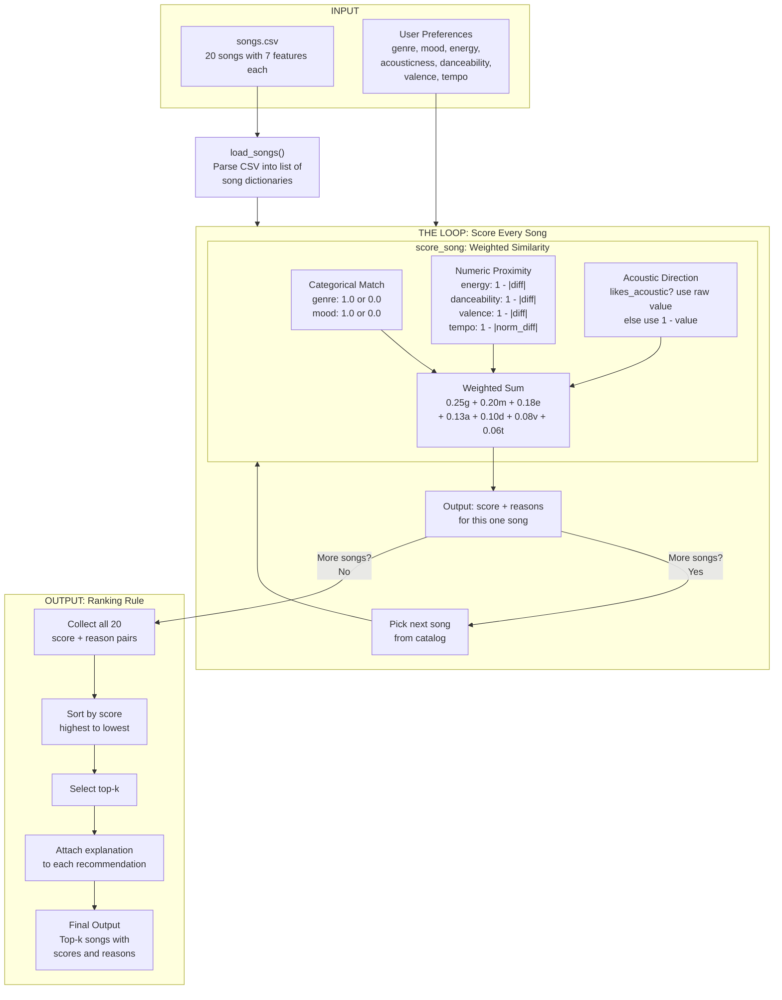
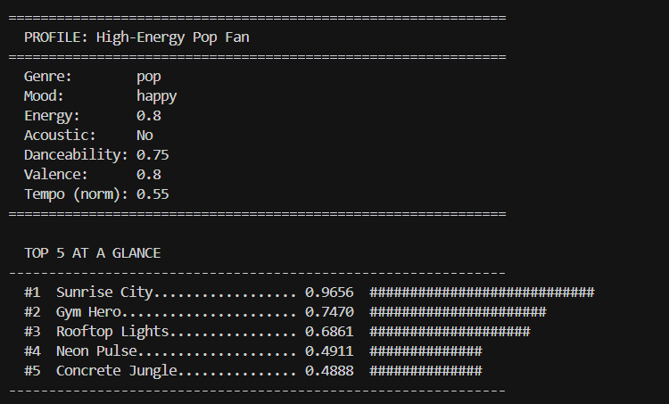
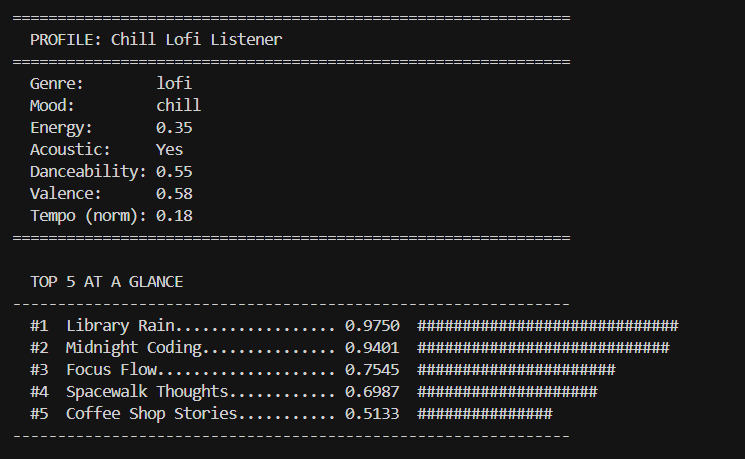
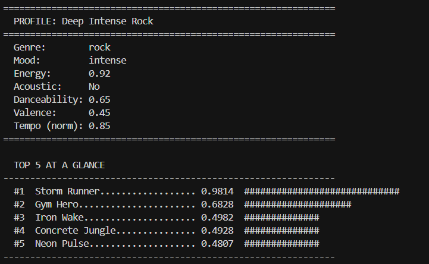
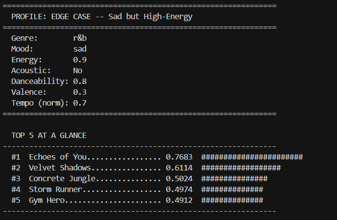
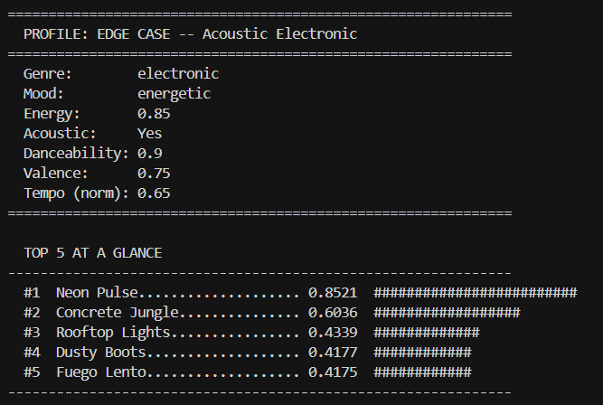

# 🎵 Music Recommender Simulation

## Project Summary

In this project you will build and explain a small music recommender system.

Your goal is to:

- Represent songs and a user "taste profile" as data
- Design a scoring rule that turns that data into recommendations
- Evaluate what your system gets right and wrong
- Reflect on how this mirrors real world AI recommenders

This project is a content-based music recommender that scores songs against a user's taste profile using seven weighted features. It does not rely on other users' behavior (collaborative filtering) — instead, it analyzes the attributes of each song and measures how closely they match what a user prefers. The system loads a catalog of 20 songs, evaluates each one with a math-based scoring rule, ranks them, and presents the top recommendations with human-readable explanations of why each song was chosen.

---

## How The System Works

### How Real-World Recommendations Work

Real-world platforms like Spotify and YouTube use two major approaches to predict what users will enjoy. **Collaborative filtering** looks at the behavior of millions of users — if people with similar listening histories tend to love a certain track, the system assumes you will too. It treats songs as opaque IDs and relies entirely on crowd patterns, which makes it powerful at surfacing surprising discoveries but vulnerable to the cold-start problem (new songs and new users have no behavioral data yet). **Content-based filtering** takes the opposite approach: it analyzes the attributes of the music itself — things like genre, tempo, energy, and mood — and builds a taste profile from what you've already listened to. It can recommend brand-new songs the moment they're released, as long as their audio features are known, but it risks creating a "filter bubble" of overly similar recommendations.

Real platforms combine both approaches into hybrid systems and layer on deep learning, natural language processing (scanning blogs and reviews for cultural context), and contextual signals like time of day or device type. Our simulation focuses purely on the content-based side, which is the most transparent and explainable approach — every recommendation can be traced back to specific feature matches.

### What Our Version Prioritizes

Our recommender prioritizes **interpretability and precision over discovery**. Rather than trying to surprise the user with unexpected picks, it focuses on finding songs that closely match a stated taste profile across multiple dimensions. Every score is a weighted sum of feature-level similarities, and every recommendation comes with a plain-language explanation of why it was chosen. This makes the system easy to understand, easy to debug, and easy to evaluate — qualities that matter in a learning context where the goal is to understand how recommenders think.

### Song Features

Each `Song` object carries seven features that the scoring rule uses:

- **genre** — A categorical label (e.g., pop, lofi, rock, jazz, ambient, synthwave, indie pop). This is the broadest taste signal and the single most important feature in our scoring rule. A genre mismatch between user and song is the fastest way to produce a bad recommendation.
- **mood** — A categorical label (e.g., happy, chill, intense, relaxed, moody, focused). Mood captures the emotional character of a song. Two songs can share a genre but feel completely different based on mood.
- **energy** — A numeric value from 0 to 1 measuring intensity and activity. Low-energy songs (0.28) feel calm and ambient; high-energy songs (0.93) feel powerful and driving. Our system rewards proximity to the user's preferred energy level, not just high or low values.
- **tempo_bpm** — Beats per minute, ranging from 60 to 152 in our catalog. Since this is on a different scale than the other numeric features, we normalize it to a 0–1 range before scoring. Tempo is correlated with energy but adds granularity — two chill songs can have noticeably different rhythmic feels.
- **valence** — A numeric value from 0 to 1 measuring musical positivity or happiness. High-valence songs sound cheerful and upbeat; low-valence songs sound darker or more melancholic. This overlaps with mood but provides finer numeric resolution.
- **danceability** — A numeric value from 0 to 1 measuring how suitable a song is for dancing based on rhythm, beat strength, and regularity. This helps separate party-ready tracks from introspective background music.
- **acousticness** — A numeric value from 0 to 1 measuring how acoustic (organic instruments) versus electronic a song sounds. This feature cleanly splits the catalog: electronic pop tracks score around 0.05–0.22 while acoustic lofi and jazz tracks score 0.71–0.92.

### UserProfile Information

Each `UserProfile` stores the user's taste preferences that map directly to the song features:

- **favorite_genre** — The genre the user prefers (e.g., "pop"). Compared as an exact match against each song's genre.
- **favorite_mood** — The mood the user prefers (e.g., "happy"). Compared as an exact match against each song's mood.
- **target_energy** — A numeric value (0–1) representing the user's preferred energy level. Scored using proximity — a song with energy close to this value scores higher than one far away.
- **likes_acoustic** — A boolean indicating whether the user prefers acoustic-sounding music. If true, songs with high acousticness score well; if false, songs with low acousticness score well.
- **target_danceability** — A numeric preference (0–1) for how danceable the user wants their music.
- **target_valence** — A numeric preference (0–1) for how musically positive or happy the user wants their music.
- **target_tempo** — A normalized numeric preference (0–1) for preferred tempo.

### How the Recommender Computes a Score

The recommender uses a **weighted sum of feature-level similarities** to produce a single score (0.0 to 1.0) for each song. Each of the seven features has an assigned weight reflecting its importance, and a similarity function that measures how well the song matches the user on that dimension:

| Feature | Weight | Similarity Function |
|---|---|---|
| genre | 0.25 | 1.0 if exact match, 0.0 otherwise |
| mood | 0.20 | 1.0 if exact match, 0.0 otherwise |
| energy | 0.18 | 1 − \|user\_energy − song\_energy\| |
| acousticness | 0.13 | song value if user likes acoustic, else 1 − song value |
| danceability | 0.10 | 1 − \|user\_danceability − song\_danceability\| |
| valence | 0.08 | 1 − \|user\_valence − song\_valence\| |
| tempo | 0.06 | 1 − \|user\_norm\_tempo − song\_norm\_tempo\| |

Genre is weighted highest because a genre mismatch is a dealbreaker — recommending rock to a jazz fan undermines trust regardless of how well the other features match. Mood is second because it determines whether a song fits the user's current emotional context. The numeric features (energy, acousticness, danceability, valence, tempo) are weighted in decreasing order of their independent discriminating power in our dataset.

### How Songs Are Chosen

The **ranking rule** orchestrates the scoring rule into a final recommendation list. It scores every song in the catalog against the user profile, sorts the results from highest to lowest score, and returns the top-k songs. This two-step design — score individually, then rank collectively — keeps the scoring logic reusable and testable in isolation while allowing the ranking step to handle list-level concerns like sorting, selection, and potential diversity enforcement.

### Data Flow Diagram

The following diagram traces how a single song travels from the CSV file through scoring to a ranked recommendation list.



**Reading the diagram:** Data flows top to bottom through three stages. The INPUT stage loads the song catalog and accepts user preferences. THE LOOP stage is where the scoring rule runs — it picks each song one at a time, computes similarity across all seven features, combines them into a weighted sum, and produces a score with reasons. Once every song has been scored, the OUTPUT stage collects all scores, sorts them from best to worst, slices the top-k, and attaches human-readable explanations to produce the final recommendation list.

### Finalized Algorithm Recipe

The complete scoring formula for a single song is:

```
score = 0.25 × genre_match
      + 0.20 × mood_match
      + 0.18 × (1 - |user_energy - song_energy|)
      + 0.13 × acoustic_match
      + 0.10 × (1 - |user_danceability - song_danceability|)
      + 0.08 × (1 - |user_valence - song_valence|)
      + 0.06 × (1 - |user_norm_tempo - song_norm_tempo|)
```

Where `genre_match` and `mood_match` are 1.0 for exact match or 0.0 otherwise, `acoustic_match` is the song's raw acousticness value if the user prefers acoustic music or `1 - acousticness` if they don't, and tempo is normalized to a 0–1 scale using `(bpm - 56) / (168 - 56)` based on the catalog's range. The ranking rule then sorts all scored songs descending and returns the top-k results with explanations.

### CLI Output

Terminal output showing the top-k recommendations for each user profile, with scores and per-feature reason breakdowns.

**Profile 1 — High-Energy Pop Fan**



**Profile 2 — Chill Lofi Listener**



**Profile 3 — Deep Intense Rock**



**Profile 4 — Edge Case: Sad but High-Energy**



**Profile 5 — Edge Case: Acoustic Electronic**



### Expected Biases and Known Trade-Offs

This system has several biases that are important to acknowledge upfront:

**Genre over-prioritization.** Genre carries the highest weight (0.25) and uses all-or-nothing binary matching. This means a song in the "wrong" genre starts with a 0.25-point penalty that the other five numeric features can never fully overcome. In practice, a mediocre genre match will always outrank an excellent cross-genre match. For example, a bland pop song that happens to share the user's preferred genre could score higher than an incredible indie pop song that perfectly matches the user's mood, energy, and danceability — simply because "indie pop" is not "pop." This is the single biggest bias in the system.

**No concept of genre or mood similarity.** The system treats all genre mismatches as equally bad. "Indie pop" and "pop" get the same 0.0 genre score as "metal" and "pop," even though indie pop is clearly closer to pop than metal is. The same applies to mood: "happy" and "energetic" are treated as just as different as "happy" and "angry." A real recommender would use embeddings or similarity matrices to recognize that some categories are neighbors.

**Filter bubble tendency.** Because the system rewards similarity on every dimension, it naturally clusters recommendations around a narrow sonic space. A user who likes happy pop will get k happy pop-adjacent songs and never discover that they might also love a chill jazz track with similar valence and danceability. There is no diversity mechanism to push the system toward variety.

**Static taste assumption.** The profile captures a single fixed snapshot of what the user wants. Real listeners change their preferences based on time of day, activity, season, and mood. A user might want chill lofi at midnight and intense rock at the gym, but our system can only serve one profile at a time.

**Acousticness is a blunt instrument.** It is the only feature scored as a boolean preference (likes acoustic vs. doesn't) rather than a numeric target. This means a user who mildly prefers acoustic music is treated identically to one who exclusively listens to unplugged sessions. Every other feature uses precise proximity scoring, but acousticness uses a binary toggle that loses nuance.

**Small catalog bias.** With only 20 songs, some genres have just one representative (e.g., one metal song, one classical song). If the user prefers one of these sparse genres, the system has almost no ability to differentiate within that genre — the one matching song will always win, regardless of how well the numeric features align. A larger catalog would make the numeric features much more meaningful for ranking within a genre.

---

## Getting Started

### Setup

1. Create a virtual environment (optional but recommended):

   ```bash
   python -m venv .venv
   source .venv/bin/activate      # Mac or Linux
   .venv\Scripts\activate         # Windows

2. Install dependencies

```bash
pip install -r requirements.txt
```

3. Run the app:

```bash
python -m src.main
```

### Running Tests

Run the starter tests with:

```bash
pytest
```

You can add more tests in `tests/test_recommender.py`.

---

## Experiments You Tried

Use this section to document the experiments you ran. For example:

- What happened when you changed the weight on genre from 2.0 to 0.5
- What happened when you added tempo or valence to the score
- How did your system behave for different types of users

---

## Limitations and Risks

Summarize some limitations of your recommender.

Examples:

- It only works on a tiny catalog
- It does not understand lyrics or language
- It might over favor one genre or mood

You will go deeper on this in your model card.

---

## Reflection

Read and complete `model_card.md`:

[**Model Card**](model_card.md)

Write 1 to 2 paragraphs here about what you learned:

- about how recommenders turn data into predictions
- about where bias or unfairness could show up in systems like this


---

## 7. `model_card_template.md`

Combines reflection and model card framing from the Module 3 guidance. :contentReference[oaicite:2]{index=2}  

```markdown
# 🎧 Model Card - Music Recommender Simulation

## 1. Model Name

Give your recommender a name, for example:

> VibeFinder 1.0

---

## 2. Intended Use

- What is this system trying to do
- Who is it for

Example:

> This model suggests 3 to 5 songs from a small catalog based on a user's preferred genre, mood, and energy level. It is for classroom exploration only, not for real users.

---

## 3. How It Works (Short Explanation)

Describe your scoring logic in plain language.

- What features of each song does it consider
- What information about the user does it use
- How does it turn those into a number

Try to avoid code in this section, treat it like an explanation to a non programmer.

---

## 4. Data

Describe your dataset.

- How many songs are in `data/songs.csv`
- Did you add or remove any songs
- What kinds of genres or moods are represented
- Whose taste does this data mostly reflect

---

## 5. Strengths

Where does your recommender work well

You can think about:
- Situations where the top results "felt right"
- Particular user profiles it served well
- Simplicity or transparency benefits

---

## 6. Limitations and Bias

Where does your recommender struggle

Some prompts:
- Does it ignore some genres or moods
- Does it treat all users as if they have the same taste shape
- Is it biased toward high energy or one genre by default
- How could this be unfair if used in a real product

---

## 7. Evaluation

How did you check your system

Examples:
- You tried multiple user profiles and wrote down whether the results matched your expectations
- You compared your simulation to what a real app like Spotify or YouTube tends to recommend
- You wrote tests for your scoring logic

You do not need a numeric metric, but if you used one, explain what it measures.

---

## 8. Future Work

If you had more time, how would you improve this recommender

Examples:

- Add support for multiple users and "group vibe" recommendations
- Balance diversity of songs instead of always picking the closest match
- Use more features, like tempo ranges or lyric themes

---

## 9. Personal Reflection

A few sentences about what you learned:

- What surprised you about how your system behaved
- How did building this change how you think about real music recommenders
- Where do you think human judgment still matters, even if the model seems "smart"

